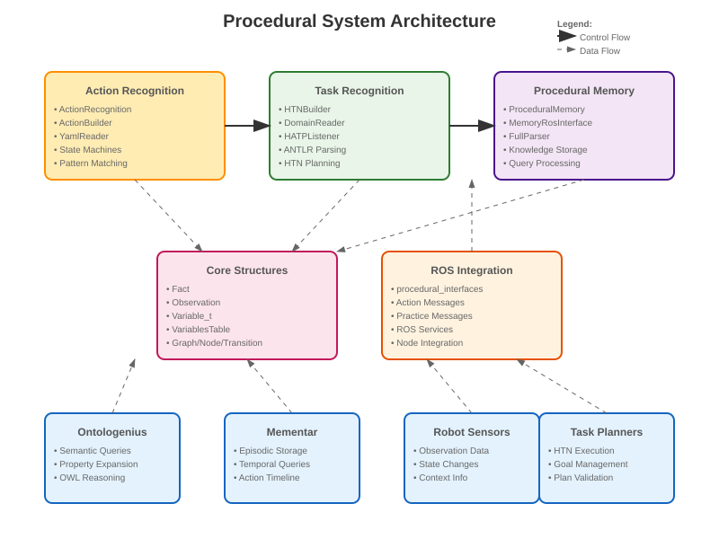
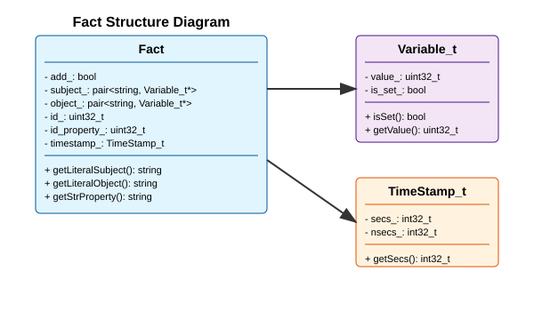
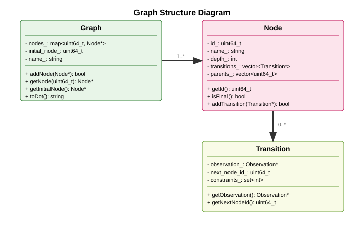
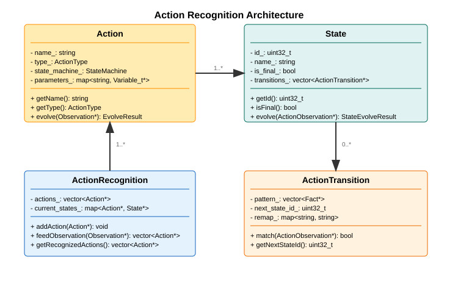
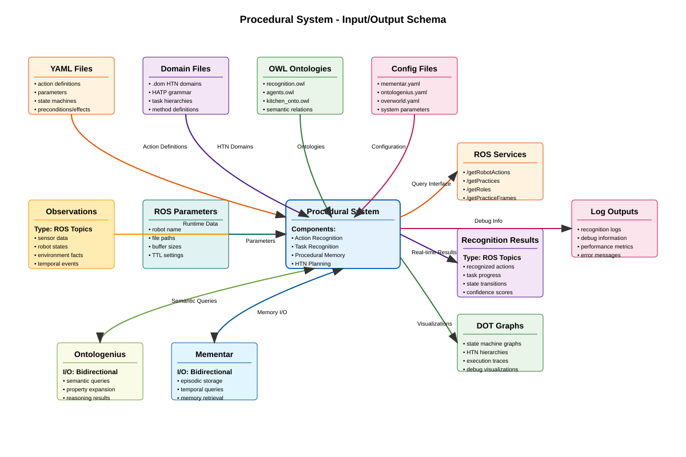

# Procedural - Système de Reconnaissance et Raisonnement Procédural


## Vue d'ensemble

Le package **Procedural** est un système avancé de reconnaissance d'actions et de raisonnement procédural pour la robotique. Il implémente des algorithmes HTN (Hierarchical Task Network) pour la planification et reconnaissance de tâches, combinés avec des machines à états pour la reconnaissance d'actions en temps réel.

## Architecture du Système



Le système est organisé en plusieurs composants modulaires interconnectés :

### 🔧 Composants Principaux

#### 1. **Reconnaissance d'Actions** (`action_recognition/`)
- **ActionRecognition** : Moteur principal de reconnaissance
- **ActionBuilder** : Construction de machines à états pour actions
- **YamlReader** : Lecture et parsing des configurations d'actions

#### 2. **Reconnaissance de Tâches** (`task_recognition/`)
- **HTNBuilder** : Construction de réseaux HTN
- **DomainReader** : Lecture des domaines de planification
- **HATPListener** : Parser ANTLR pour les grammaires HTN

#### 3. **Mémoire Procédurale** (`memory/`)
- **ProceduralMemory** : Stockage et récupération des connaissances
- **MemoryRosInterface** : Interface ROS pour la mémoire
- **FullParser** : Analyseur complet pour domaines complexes

#### 4. **Structures de Données** (`structures/`)
- **Fact** : Représentation des faits du monde
- **Observation** : Observations des capteurs robot
- **Graph/Node/Transition** : Structures graphiques pour machines à états

### 🏗️ Structures de Données Principales

#### Structure des Faits (Facts)



Les **Facts** représentent l'état du monde sous forme de triplets RDF, avec des variables liées dynamiquement et un horodatage.

#### Architecture des Graphes d'États



Les **Graphs** organisent les nœuds et transitions pour la reconnaissance de séquences d'actions et la navigation dans l'espace d'états.

#### Système de Reconnaissance d'Actions



Le moteur de **reconnaissance d'actions** utilise des machines à états pour identifier les actions robotiques à partir d'observations en temps réel.

### Structures Principales

- **Fact** : Triplets RDF pour représenter l'état du monde avec variables liées
- **Observation** : Données d'observation des capteurs avec contexte HTN  
- **Graph/Node/Transition** : Graphes d'états pour machines de reconnaissance
- **Action/State** : Actions robotiques avec machines à états intégrées
- **Variable_t** : Système de variables avec liaison et résolution dynamique

Voir les diagrammes interactifs dans [`docs/structures_data.drawio`](docs/structures_data.drawio).

## Installation

### Prérequis

```bash
sudo apt install libgmock-dev
```

### Construction

Depuis le répertoire racine de l'espace de travail catkin :

```bash
# Construction complète
catkin build

# Construction du package spécifique
catkin build procedural
```

## Utilisation

### Nœud Principal

```bash
# Lancer le nœud de mémoire procédurale
roslaunch procedural recognition.launch

# Avec ontologies
roslaunch procedural ontologenius_mementar.launch
```

### Tests

```bash
# Tous les tests
catkin test procedural

# Tests spécifiques
./devel/lib/procedural/ActionRecognition_test
./devel/lib/procedural/Graph_test
```

### Configuration

Les fichiers de configuration sont dans `configs/` :
- `mementar.yaml` : Configuration de la base de connaissances
- `ontologenius.yaml` : Configuration ontologique
- `overworld.yaml` : Environnement de simulation

## Grammaires et Parsing

Le système utilise **ANTLR 4.13.0** pour parser les DSL :

### Grammaires HTN
- `HATPLexer.g4` / `HATPParser.g4` : Grammaire HATP standard
- `ExtentedHATPLexer.g4` : Extension pour actions robotiques

### Grammaires d'Actions
- `RobotActionLexer.g4` / `RobotActionParser.g4` : Actions robotiques spécialisées

## Schéma Entrées/Sorties du Système



Le système Procedural traite plusieurs types d'entrées et génère différents types de sorties :

### 📥 Entrées

#### Configuration (Chargement Initial)
- **Fichiers YAML** : Définitions d'actions avec paramètres et machines à états
- **Domaines HTN** : Fichiers .dom avec hiérarchies de tâches et grammaires HATP
- **Ontologies OWL** : Relations sémantiques et connaissances du domaine
- **Fichiers Config** : Paramètres système (mementar.yaml, ontologenius.yaml)

#### Runtime (Exécution)
- **Observations ROS** : Données capteurs, états robot, événements temporels
- **Paramètres ROS** : Configuration dynamique (nom robot, tailles buffers, TTL)

#### Systèmes Externes (Bidirectionnel)
- **Ontologenius** : Requêtes sémantiques et expansion de propriétés
- **Mementar** : Stockage épisodique et requêtes temporelles

### 📤 Sorties

#### Services ROS
- `/getRobotActions` : Actions disponibles pour un robot
- `/getPractices` : Pratiques collaboratives par contexte
- `/getRoles` : Rôles d'agents pour pratiques spécifiques
- `/getPracticeFrames` : Historique d'exécution des pratiques

#### Publications Temps Réel
- **Topics ROS** : Actions reconnues, progression tâches, scores de confiance
- **Visualisations DOT** : Graphes machines à états, hiérarchies HTN, traces d'exécution
- **Logs Debug** : Informations reconnaissance, métriques performance

## API et Interfaces

### Services ROS

Le système expose plusieurs services via `procedural_interfaces` :

```cpp
// Récupération d'actions
procedural_interfaces::getRobotActions

// Récupération de pratiques
procedural_interfaces::getPractices
```

### Messages

```cpp
// Action complète avec paramètres
procedural_interfaces::Action

// Observation d'événement
procedural_interfaces::Practice
```

## Exemples d'Utilisation

### Configuration d'Action (YAML)

```yaml
actions:
  - name: "grasp"
    type: "simple"
    parameters:
      - name: "object"
        type: "string"
    states:
      - name: "start"
        transitions:
          - pattern: ["?agent", "grasping", "?object"]
            next_state: "grasped"
```

### Domaine HTN

```hatp
domain kitchen {
  task PrepareMeal {
    method sequential {
      subtasks: [GetIngredients, Cook, Serve]
      constraints: [before(GetIngredients, Cook)]
    }
  }
}
```

## Développement

### Structure des Tests

```
test/
├── action_recognition/     # Tests reconnaissance d'actions
├── structures/            # Tests structures de données  
├── task_recognition/      # Tests HTN
└── launch/               # Tests d'intégration ROS
```

### Ajout de Nouvelles Actions

1. Définir l'action en YAML dans `test/action_recognition/`
2. Créer les tests unitaires correspondants
3. Intégrer dans la configuration globale

### Extension des Grammaires

1. Modifier les grammaires `.g4` dans `grammar/`
2. Régénérer avec ANTLR (automatique via CMake)
3. Adapter les listeners C++

## Intégration avec l'Écosystème

### Ontologenius
- Requêtes sémantiques sur ontologies OWL
- Expansion des propriétés d'objets
- Raisonnement automatique

### Mementar  
- Stockage épisodique des expériences
- Récupération contextuelle
- Timeline des actions

## Documentation Technique

- **Architecture détaillée** : [`docs/structures_data.drawio`](docs/structures_data.drawio)
- **Grammaires ANTLR** : [`include/procedural/memory/grammar/`](include/procedural/memory/grammar/)
- **Exemples de domaines** : [`test/task_recognition/Builder/`](test/task_recognition/Builder/)
- **Configurations** : [`configs/`](configs/)

## Statut du Développement

### ✅ Fonctionnalités Implémentées
- [x] Liaison onto pour extension des variables et typage
- [x] Vérification des transitions et liaison des variables sur actions composées  
- [x] Threading pour la reconnaissance d'actions

### 🚧 En Cours de Développement
- [ ] Interface ROS complète
- [ ] Reconnaissance de tâches avancée

## Licence

Ce projet est sous licence MIT. Voir le fichier [LICENSE](LICENSE) pour plus de détails.

## Contribution

1. Fork le projet
2. Créer une branche feature (`git checkout -b feature/AmazingFeature`)
3. Commit les changements (`git commit -m 'Add AmazingFeature'`)
4. Push vers la branche (`git push origin feature/AmazingFeature`)
5. Ouvrir une Pull Request

## Support

Pour toute question ou problème :
- **Issues** : [GitHub Issues](https://github.com/your-org/procedural/issues)
- **Documentation** : Consultez les diagrammes dans `docs/`
- **Tests** : Exécutez `catkin test procedural` pour validation
 